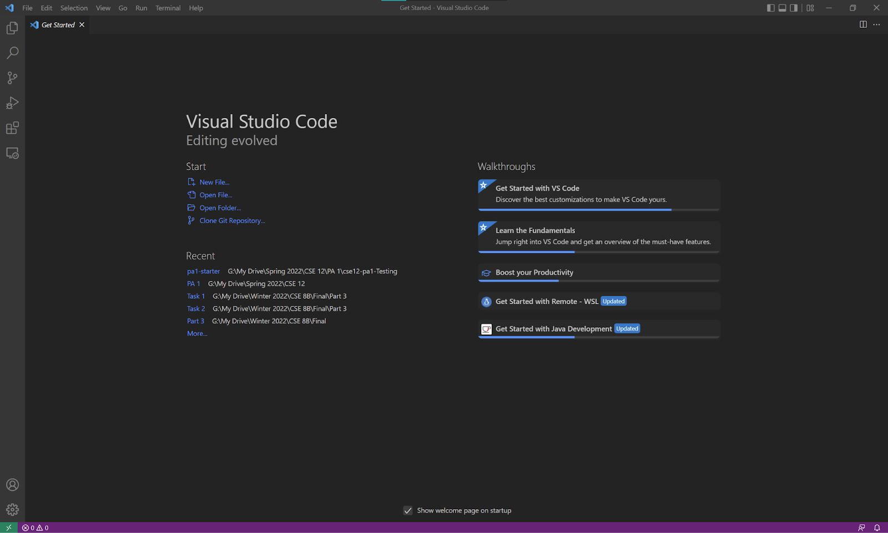
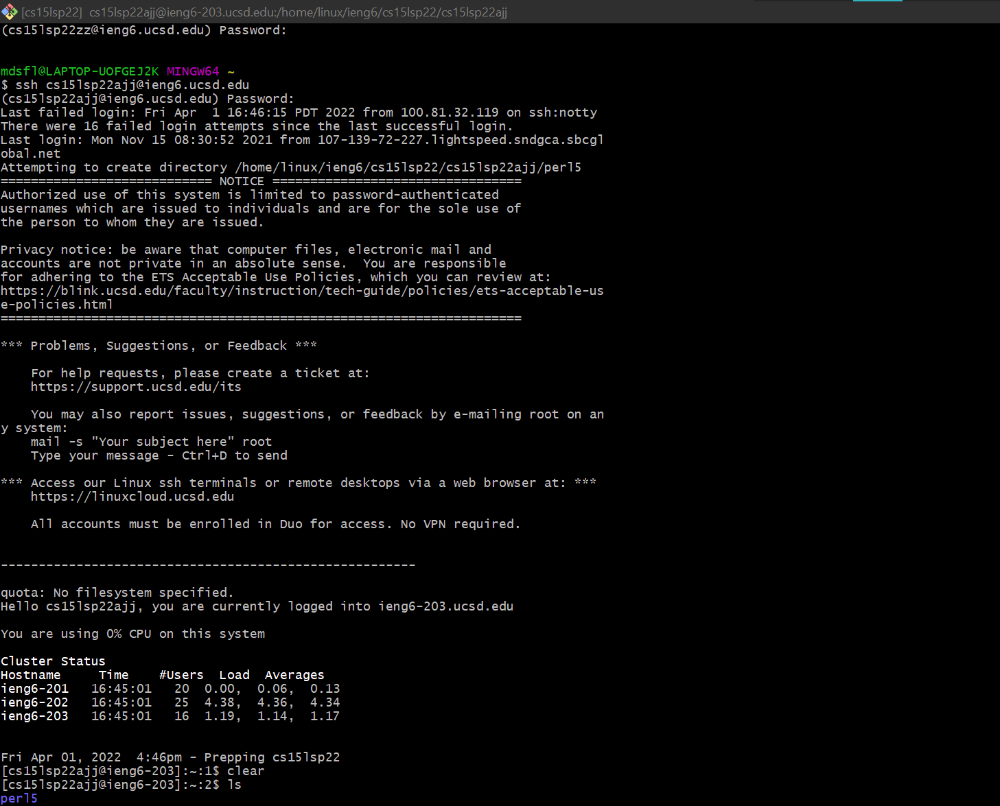
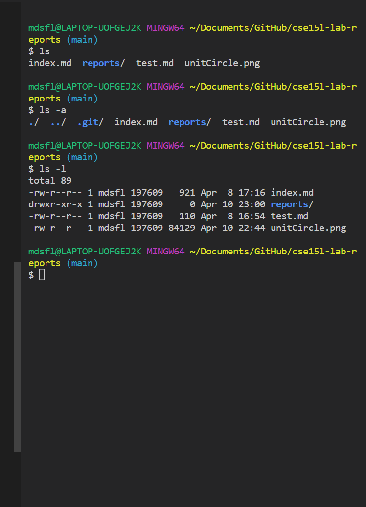
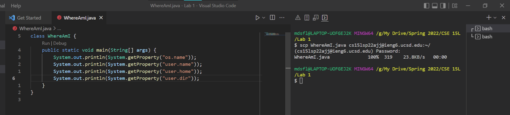

# Lab Report 1 (How to log into ieng6)

This guide is primarily targetted toward Windows Users.

## Installing Visual Studio Code (VSCode)

[Here](https://code.visualstudio.com/) you can find the VSCode
download.
For Windows, simply download the installer and navigate through the prompts.

When you are done, open VSCode, and you should be greeted to this:


- When I did this, I had vscode installed already
- This means that the screenshot above may not match up perfectly
  to a fresh install of vscode

## Installing OpenSSH

The following is based on [this](https://docs.microsoft.com/en-us/windows-server/administration/openssh/openssh_install_firstuse).

1. Open Powershell in Administrator Mode
1. Run the following to check whether Open-SSH is open

   ```
   Get-WindowsCapability -Online | Where-Object Name -like 'OpenSSH\*'
   ```

   This should output the following if OpenSSH is not installed.

   ```
   Name  : OpenSSH.Client~~~~0.0.1.0
   State : NotPresent

   Name  : OpenSSH.Server~~~~0.0.1.0
   State : NotPresent
   ```

1. Next install Open-SSH client and server by running

   ```
    # Install the OpenSSH Client
    Add-WindowsCapability -Online -Name OpenSSH.Client~~~~0.0.1.0

    # Install the OpenSSH Server
    Add-WindowsCapability -Online -Name OpenSSH.Server~~~~0.0.1.0
   ```

- When I did this, I had trouble downloading and installing OpenSSH
  server.
- However, throughout the project, we did not have to host an SSH server.
  This means that until we need to ssh into my laptop, OpenSSH server may not be necessary.

## Connecting through SSH to ieng6

SSH(Secure Shell) is a protocal in order to easily connect into the
console of a computer or server.
In this tutorial, we will connect to ieng6 through ssh.

**First**, look up your course specific account
[here](https://sdacs.ucsd.edu/~icc/index.php).

**Second**, open a terminal such as Powershell or Git Bash, and run

```
ssh cs15lsp22zzz@ieng6.ucsd.edu
```

However, be sure to replace zzz with the corresponding letters in your
course-specific account.

This will most likely result in a message

```
The authenticity of host 'ieng6.ucsd.edu (128.54.70.227)' can't be established.
RSA key fingerprint is SHA256:ksruYwhnYH+sySHnHAtLUHngrPEyZTDl/1x99wUQcec.
Are you sure you want to continue connecting (yes/no/[fingerprint])?
```

Be sure to simply type yes.
Finally, it will ask you for your Active Directory Password.

This iteraction should most likely look like


## Trying Linux Commands

There are many linux commands you could try after connecting to the server.

Some of the ones that I used were:

- `mv`: moves/renames a file
- `cp`: copies a file
- `ls`: list contents of a directory
- `ls -a`: list all contents of a directory
- `ls -l`: list all contents of a directory with their corresponding permissions

Here are some examples:


## Moving Files with `scp`

`scp` is very similar to `ssh`. Instead of running unix commands on the server,
`scp` utilizes SSH protocal in order to transfer files from devices.
In the lab, we created a test file called `WhereAmI.java`.
Then we used the command

```
scp WhereAmI.java cs15lsp22zzz@ieng6.ucsd.edu:~/
```

Recall that `cs15lsp22zzz` is the username, `ieng6.ucsd.edu` is the server,
and `~/` is the directory. Thus, this command copies `WhereAmI.java` to the
`~/` directory.

Here is an example of me using `scp`.


## SSH Keys

SSH keys are an alternative form of authentication which allows you to avoid
constantly having to enter your password.

Call `ssh-keygen` to generate a "rsa key pair".
This creates two files: `id_rsa`, `id_rsa.pub`.
`id_rsa.pub` contains the public key.

Next use scp to copy `id_rsa.pub` to `~/.ssh/authorized_keys` on `ieng6`.
This will look like:

```
scp /Users/<user-name>/.ssh/id_rsa.pub cs15lsp22zz@ieng6.ucsd.edu:~/.ssh/authorized_keys
```

## Optimizing Remote Running

By using `&&`, you can combine multiple statements into one line.
During the lab I created the command:

```
scp WhereAmI.java cs15lsp22zzz@ieng6.ucsd.edu:~/ && ssh cs15lsp22zzz@ieng6.ucsd.edu "cd ~ && javac WhereAmI.java && java WhereAmI"
```

For my account, this becomes:

```
scp WhereAmI.java cs15lsp22ajj@ieng6.ucsd.edu:~/ && ssh cs15lsp22ajj@ieng6.ucsd.edu "cd ~ && javac WhereAmI.java && java WhereAmI"
```
