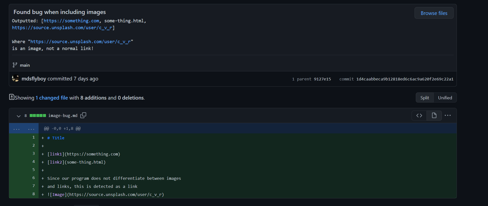
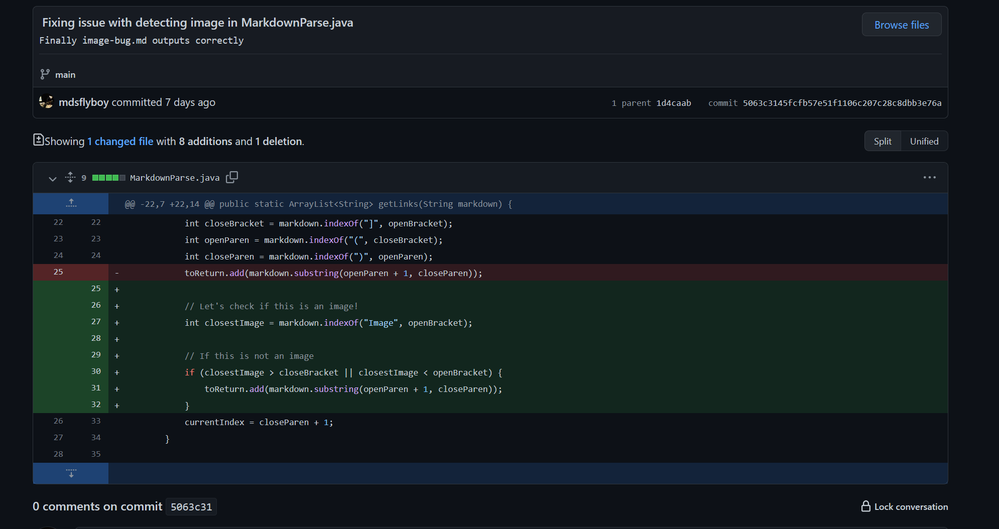
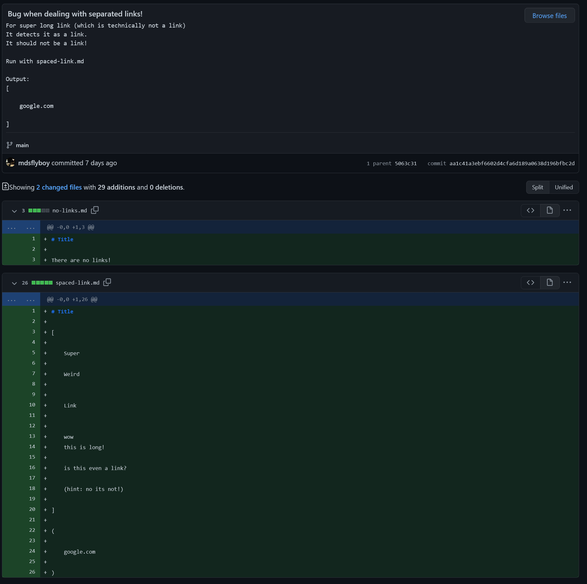
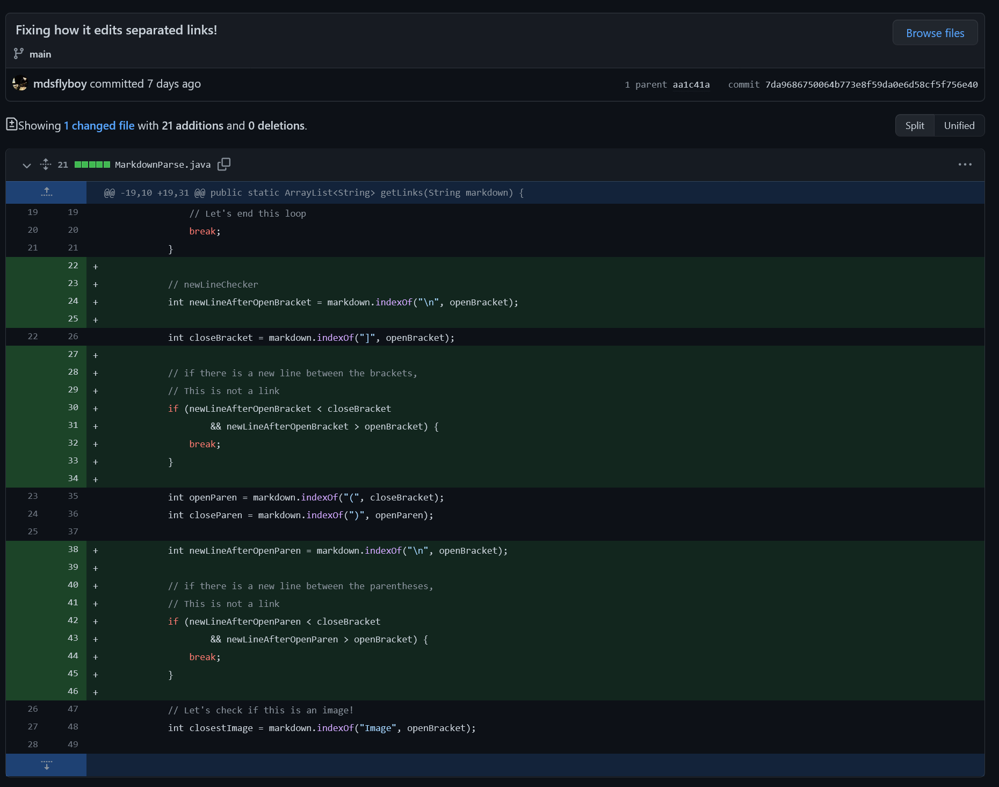

# Lab Report 2

For this lab, we must analyze 3 code changes.

## Code Change 1 (Found bug when including images)

Found an issue with the code when images are in the markdown file.
The program assumes that the image is actually a link due to the similar syntax.

### Adding the test case

[Find the change here](https://github.com/mdsflyboy/markdown-parser/commit/1d4caabbeca9b12818ed6c6ac9a620f2e69c22a1)

[Find the test file here](report2resources/image-bug.md)

### Fixing the bug

[Find the change here](https://github.com/mdsflyboy/markdown-parser/commit/5063c3145fcfb57e51f1106c207c28c8dbb3e76a)

## Code Change 2 (Bug when dealing with separated links!)

We found that if the links are spaced out on multiple lines, the program
will think that this is a functional link.
Unfortunately, markdown does not actually interpret this as a link.
Thus, this special case must be checked for.

### Adding the test case

[Find the change here](https://github.com/mdsflyboy/markdown-parser/commit/aa1c41a3ebf6602d4cfa6d189a0638d196bfbc2d)

[Find the test file here](report2resources/spaced-link.md)

### Fixing the bug

[Find the change here](https://github.com/mdsflyboy/markdown-parser/commit/7da9686750064b773e8f59da0e6d58cf5f756e40)

## Code Change 3
