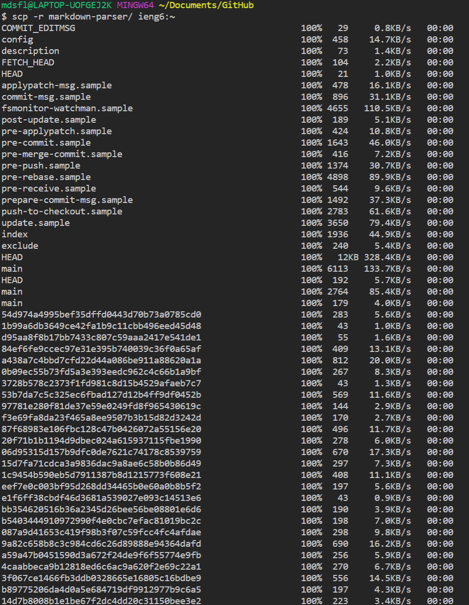

# Lab Report 3

## Streamlining your ssh Configuration
Assuming you're on windows, open Git Bash.
If you're familiar with vim editor, you can edit your ssh
configuration with the command:

    vim ~/.ssh/config

Next, edit or add the host ieng6 such that the config file
will look like the following (except with a different username)

Now all you need to login is run the followign command

    ssh ieng6

You should see an output similar to:

Isn't this so much easier than typing in that 
super long command!

This also works for `scp` as well:

## Setup Github Access from ieng6
When you access Github, you can authenticate your user in a multitude of ways. 
The default method of authentication is standard username and password.
However, earlier in this course we looked at using saved ssh keys in order
to use your Github repositories.
You can view your saved ssh keys on github by clicking 
Profile -> Settings -> SSH and GPG keys.
You can view this in the screenshot below.

On your computer, you also have saved your private ssh key in 
`~/.ssh/id_ed25519`.
Here you can view the location of the private key on the ieng6 server.

Next, copy your public key from `~/.ssh/id_ed25519.pub`.
Then, go back to github, and click "New SSH Key" and paste the public key
into the box.

If necessary, you may need to add the following to your `./ssh/config`

    Host github.com
        HostName github.com
        User gerald
        IdentityFile ~/.ssh/id_rsa_github

Here is an example of me using ssh to commit and push a change from ieng6:

You can checkout this change [here](https://github.com/mdsflyboy/skill-demo/commit/7cb3e2af0a027cee18cb723b4cb1c795fa66b77a).

## Copy whole directories with `scp -r`

`scp` is a powerful linux command. However, did you know that you can use this
command in order to copy whole directories to the server.
Simply, add the `-r` flag in order to copy a whole directory.
Here is an example

With scp, you can also run some commands afterwards!

