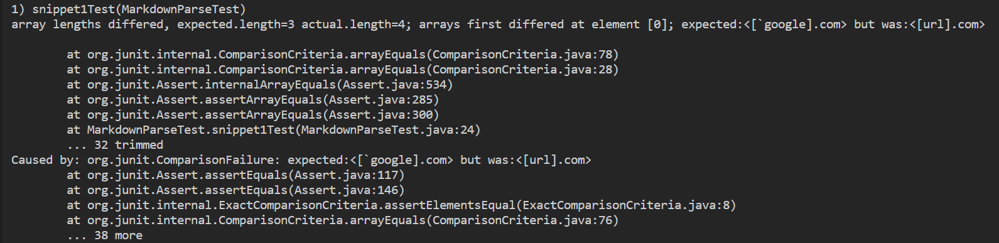
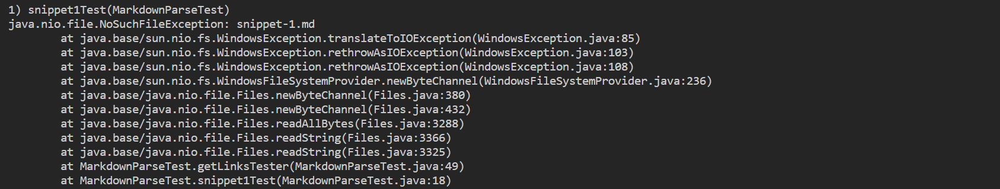
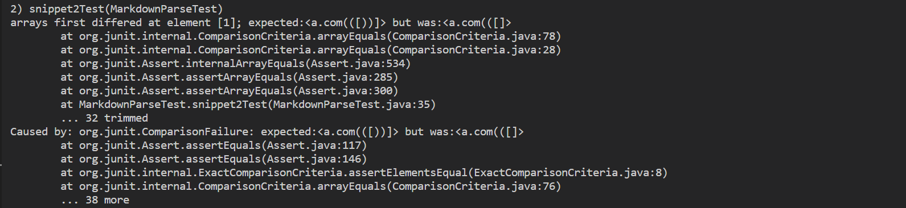
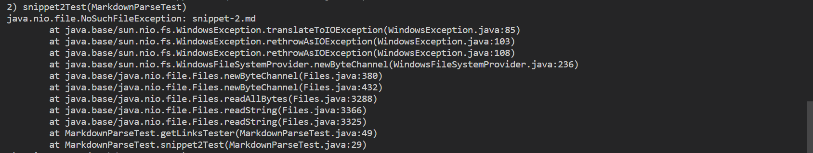
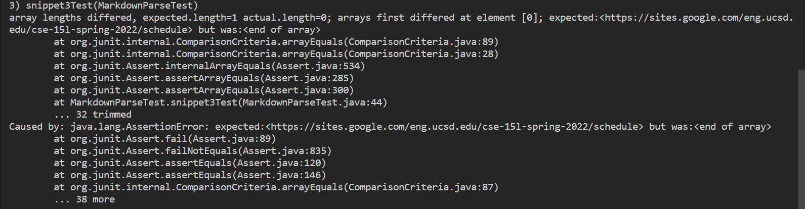
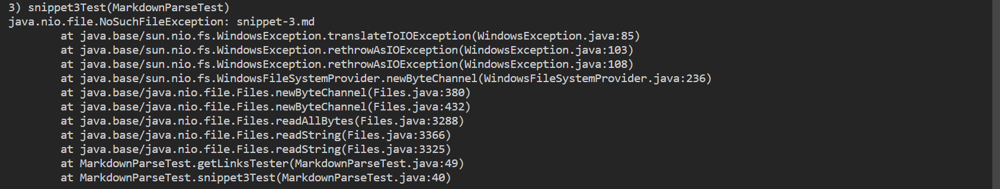

# Lab Report 4

In this lab I worked the following repositories:

* [Our group repo](https://github.com/mdsflyboy/markdown-parser)
* [Another group's repo](https://github.com/Sking56/markdown-parser)

In this lab I am testing several snippets listed in the remaining sections.
For each snippet I'll show 
* the expected output
* the code in `MarkdownParseTest.java`
* the test failure or sucess for both repos

Keep in mind that `MarkdownParseTest.java` contains a helper function that
is defined as follows:
```java
private ArrayList<String> getLinksTester(String fileName) throws IOException {
    Path file = Path.of(fileName);
    String content = Files.readString(file);
    ArrayList<String> links = MarkdownParse.getLinks(content);
    return links;
}
```
Also I used the same `MarkdownParseTest.java` for both repos.

## Snippet 1
```
`[a link`](url.com)

[another link](`google.com)`

[`cod[e`](google.com)

[`code]`](ucsd.edu)
```
Expected Output:
```
["url.com", "`google.com", "ucsd.edu"]
```
Code in `MarkdownParseTest.java` for the test:
```java
@Test
public void snippet1Test() throws IOException {
    ArrayList<String> links = getLinksTester("snippet-1.md");
    List<String> expectedLinks = List.of(
        "`google.com",
        "google.com",
        "ucsd.edu"
    );
    assertArrayEquals(expectedLinks.toArray(), links.toArray());
}
```
Our group's Test failed output:

Their group's Test failed output:


## Snippet 2
```
[a [nested link](a.com)](b.com)

[a nested parenthesized url](a.com(()))

[some escaped \[ brackets \]](example.com)
```
Expected output:
```
["a.com", "a.com(())", "example.com"]
```
Code in `MarkdownParseTest.java` for the test:
```java
@Test
public void snippet2Test() throws IOException {
    ArrayList<String> links = getLinksTester("snippet-2.md");
    List<String> expectedLinks = List.of(
        "a.com",
        "a.com(())",
        "example.com"
    );
    assertArrayEquals(expectedLinks.toArray(), links.toArray());
}
```
Our group's Test failed output:

Their group's Test failed output:


## Snippet 3
```
[this title text is really long and takes up more than 
one line

and has some line breaks](
    https://www.twitter.com
)

[this title text is really long and takes up more than 
one line](
https://sites.google.com/eng.ucsd.edu/cse-15l-spring-2022/schedule
)


[this link doesn't have a closing parenthesis](github.com

And there's still some more text after that.

[this link doesn't have a closing parenthesis for a while](https://cse.ucsd.edu/


)

And then there's more text
```
Expected output:
```
["https://sites.google.com/eng.ucsd.edu/cse-15l-spring-2022/schedule"]
```
Code in `MarkdownParseTest.java` for the test:
```java
@Test
public void snippet3Test() throws IOException {
    ArrayList<String> links = getLinksTester("snippet-3.md");
    List<String> expectedLinks = List.of(
        "https://sites.google.com/eng.ucsd.edu/cse-15l-spring-2022/schedule"
    );
    assertArrayEquals(expectedLinks.toArray(), links.toArray());
}
```
Our group's Test failed output:

Their group's Test failed output:


# Questions
Q1: Do you think there is a small (<10 lines) code change that will make your program work for snippet 1 and all related cases that use inline code with backticks? If yes, describe the code change. If not, describe why it would be a more involved change.

A: I think there is a small change that will make my program work for
snippet 1.
Before entering the while loop, I would remove any items surrounded by `
from the original string.
This would have removed "links" that are not actually links in this situation.

Q2: Do you think there is a small (<10 lines) code change that will make your program work for snippet 2 and all related cases that nest parentheses, brackets, and escaped brackets? If yes, describe the code change. If not, describe why it would be a more involved change.

A: I think this case requires a large change to fix.
In order to fix this situation, I think from the first parenthesis, 
I would loop through each character and create a counter of open parentheses.
After every closed parenthesis, this counter would decrease. Thus, the link would end once the counter reaches 0.

Q3: Do you think there is a small (<10 lines) code change that will make your program work for snippet 3 and all related cases that have newlines in brackets and parentheses? If yes, describe the code change. If not, describe why it would be a more involved change.

A: I think this case can be accounted for with a small change. before adding a link, I would check for how many new lines exist at the beginning and end of the link string. If there is 1 for both the beginning and end, I would remove those lines and add the link to the output. Otherwise, if there are more than 1 new line character before or after the link, I would skip that link and continue on. Currently, we ignore any links with new line characters in them. 