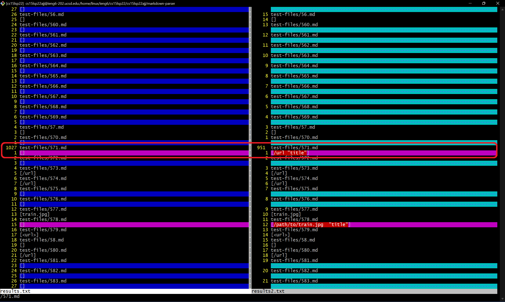
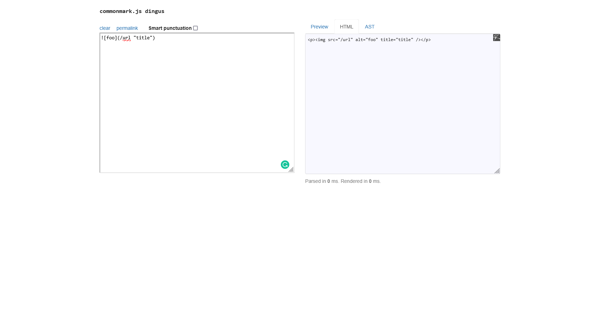
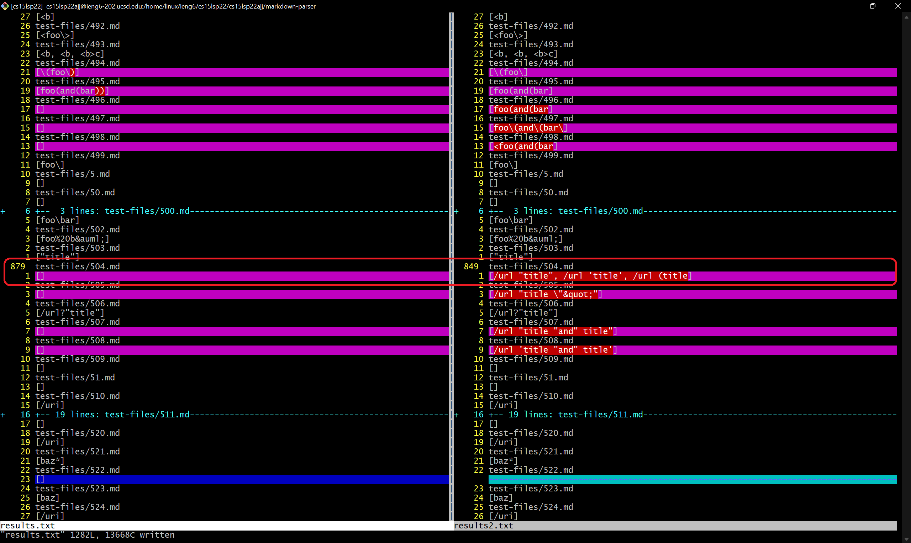
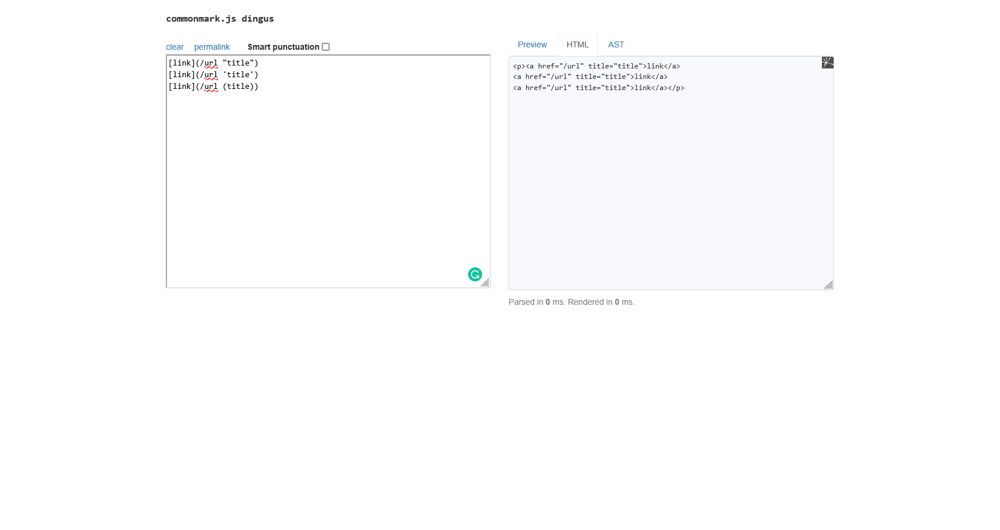

# Lab Report 5

For this lab report, we're comparing the difference between two different implementations of 
`MarkdownParser.java`.
I noticed that our implementation and the given implementation differ for tests
[`571.md`](https://github.com/nidhidhamnani/markdown-parser/blob/main/test-files/571.md)
and 
[`504.md`](https://github.com/nidhidhamnani/markdown-parser/blob/main/test-files/504.md?plain=1).

## How I found these test cases
In order to find these test cases, I used the `script.sh` file provided in the 
lab 9 repository in order to load the results of each test into a `txt` file.
Although I modified the script in order to make identifying which test is problematic
easier. The final script that was used is as follows
```sh
for file in test-files/*.md;
do
        echo $file
        java MarkdownParse $file
done
```

In order to load the results of the tests into a file, I ran the following in the
console
```sh
chmod +x script.sh
./script.sh > results.txt
```
`chmod` modifies the permisions of the script in order to enable execution of the
file.
The `>` operator takes all the console output of `./script.sh` and loads it into
the file `results.txt`. 
When running our implementation, we used a very similar script called `my_script.sh`
and loaded the results into `results2.txt`.

In order to compare the outputs between my output and their output I used `vimdiff`.
This was done by using the following input 
```sh
vimdiff results.txt results2.txt
```

## Explanation of the bug
As a reminder, the test files are
[`571.md`](https://github.com/nidhidhamnani/markdown-parser/blob/main/test-files/571.md)
and 
[`504.md`](https://github.com/nidhidhamnani/markdown-parser/blob/main/test-files/504.md?plain=1).

### `571.md`
Here is a screenshot from vimdiff:

For `571.md`, I believe that their implementation is correct.
When running the file on [the CommonMark demo site](https://spec.commonmark.org/dingus/),
I found that the one line resembling a link is read as an image 
rather than a link.

Here is the output from [the CommonMark demo site](https://spec.commonmark.org/dingus/):


Thus, the output 
```
[]
```
is to be expected.
Thus, their implementation is the correct one.

### `504.md`
Here is a screenshot from vimdiff:

For `504.md`, I believe that neither implementation is correct, although 
our implementation is close.
When running the file on [the CommonMark demo site](https://spec.commonmark.org/dingus/),
I found that all the lines resembling a link are read as links.
However, our program has issues reading the extra parenthesis in the last link.

Here is what [the CommonMark demo site](https://spec.commonmark.org/dingus/)
outputted:


The output
```
[/url "title",/url 'title',/url (title)]
```
is expected.
This is different than either implementations.